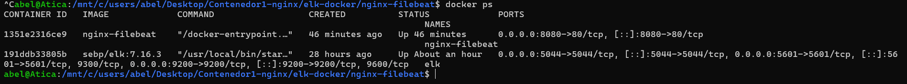
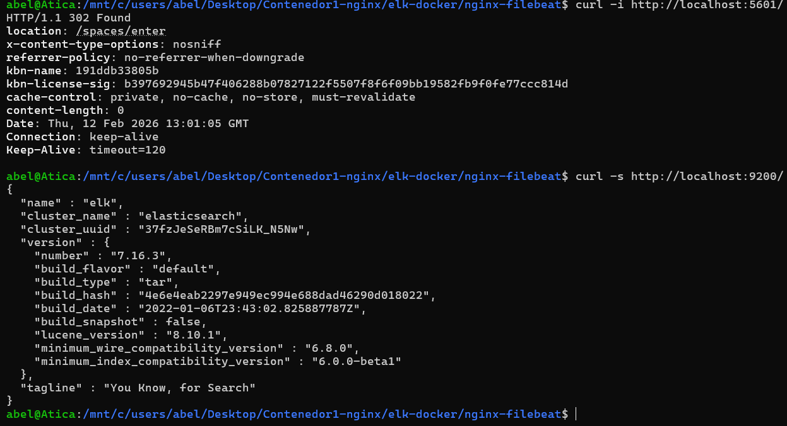
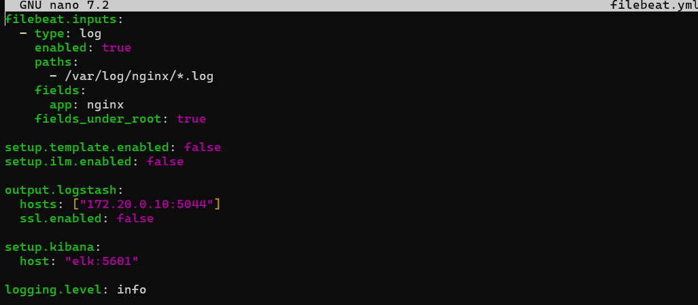
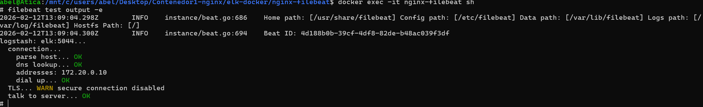
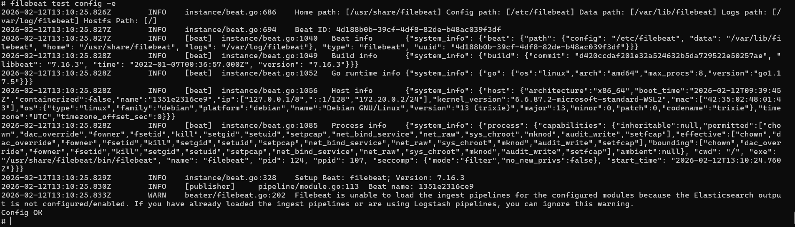
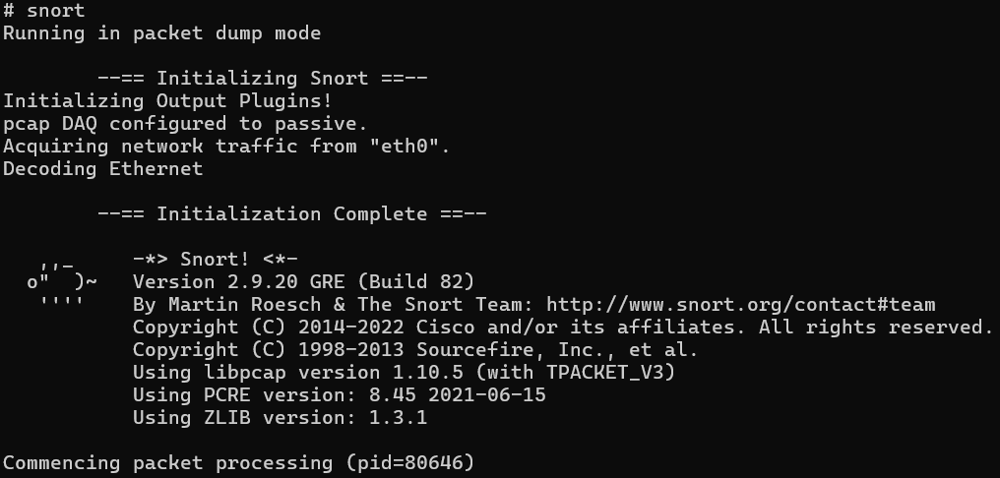
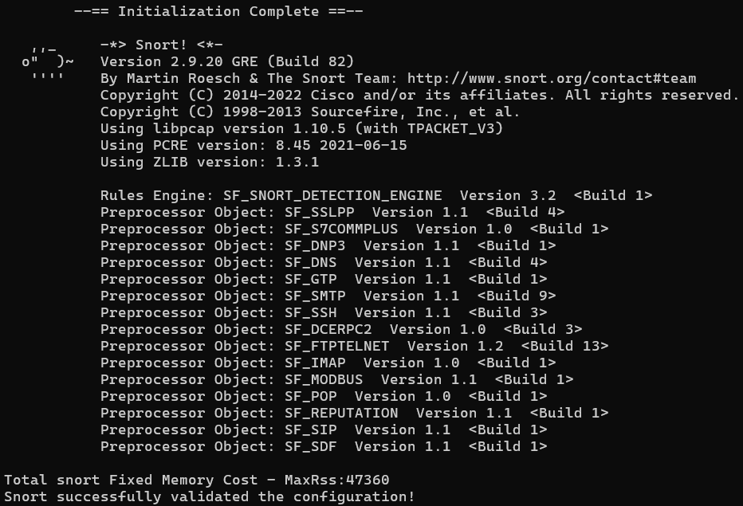
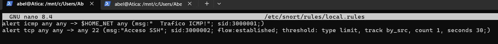
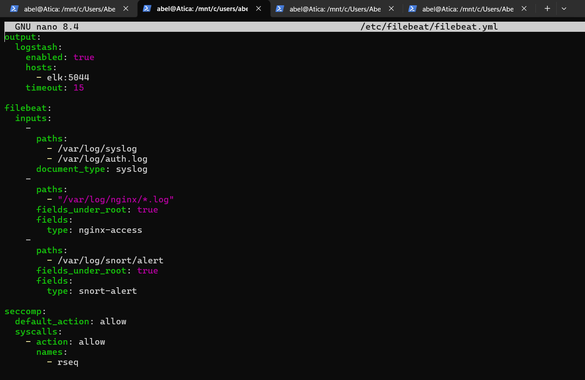

# Instalación y configuración SIEM + Agente

**Autor:** Abel García Domínguez  
**Proyecto:** Despliegue ELK 7.16.3 + Nginx/Filebeat + Snort 2.9.20  
**Fecha:** Febrero 2026

---

## Arquitectura desplegada

```
Red Docker: elk-red (172.20.0.0/24)

┌─────────────────┐    ┌──────────────────────┐
│   SIEM (ELK)    │    │   Agente Endpoint    │
│ 172.20.0.10     │◄──►│  nginx-filebeat      │
├─────────────────┤    │  + Snort IDS         │
│ • Kibana:5601   │    ├──────────────────────┤
│ • ES:9200       │    │ • Nginx:8080         │
│ • Logstash:5044 │    │ • Filebeat → 5044    │
└─────────────────┘    │ • Snort → alerts     │
                       └──────────────────────┘
```

---

## 1. Despliegue SIEM (ELK 7.16.3)

### 1.1 Red Docker dedicada

```bash
docker network create -d bridge --subnet 172.20.0.0/24 elk-red
```

### 1.2 Contenedor ELK (IP estática)

```bash
docker pull sebp/elk:7.16.3
docker run -p 5601:5601 -p 9200:9200 -p 5044:5044 \
  --name elk --net elk-red --ip 172.20.0.10 -d sebp/elk:7.16.3
```



### 1.3 Validación de servicios

```bash
curl -i http://localhost:5601       # Kibana ✓
curl -s http://localhost:9200/      # Elasticsearch ✓
```



---

## 2. Agente: Nginx + Filebeat 7.16.3

### 2.1 Construcción de imagen

```bash
cd nginx-filebeat/
docker build -t nginx-filebeat .
docker run -d --name agent --net elk-red -p 8080:80 nginx-filebeat
```

### 2.2 Configuración Filebeat (`filebeat.yml`)

```yaml
filebeat.inputs:
  - type: log
    paths: ["/var/log/nginx/*.log"]
    fields: {app: "nginx"}
    fields_under_root: true

output.logstash:
  hosts: ["172.20.0.10:5044"]
  ssl.enabled: false

setup.kibana:
  host: "elk:5601"
```



### 2.3 Tests de conectividad

```bash
filebeat test config -e     # Configuración ✓
filebeat test output -e     # Logstash ✓
```




---

## 3. Instalación Snort 2.9.20 (desde fuente)

### 3.1 Dependencias base

```bash
apt-get update && apt-get install -y \
  build-essential bison flex libpcap-dev libpcre3-dev \
  zlib1g-dev libdumbnet-dev libtirpc-dev pkg-config
```

### 3.2 Compilación DAQ + Snort

```bash
# DAQ 2.0.7
wget https://www.snort.org/downloads/snort/daq-2.0.7.tar.gz
tar -xzf daq-2.0.7.tar.gz && cd daq-2.0.7
./configure && make && make install && ldconfig

# Snort 2.9.20
wget https://www.snort.org/downloads/snort/snort-2.9.20.tar.gz
tar -xzf snort-2.9.20.tar.gz && cd snort-2.9.20
./configure --enable-sourcefire --disable-open-appid
make && make install && ldconfig
```



> Verificación: `snort --version` → 2.9.20 confirmado.

---

## 4. Troubleshooting resuelto

| Error | Causa | Solución |
|-------|-------|----------|
| TLS handshake fail | Filebeat 8.x vs ELK 7.16 | Alinear versiones a 7.16.3 + `ssl.enabled: false` |
| `pcre.h` not found | Falta PCRE dev | Compilar PCRE 8.45 + exportar `CPPFLAGS`/`LDFLAGS` |
| LuaJIT not found | OpenAppID habilitado | `./configure --disable-open-appid` |
| `rpc/rpc.h` missing | RPC headers modernos | `apt install libtirpc-dev` |
| `RULE_PATH` inválido | Ruta relativa `../rules` | `var RULE_PATH /etc/snort/rules` + `mkdir -p` |
| Filebeat muerto | `service start` en contenedor | Ejecutar `filebeat -e` (foreground) |

---

## 5. Configuración Snort (`snort.conf`)

### 5.1 Estructura de directorios

```bash
mkdir -p /etc/snort/rules /usr/local/lib/snort_dynamicrules
cp /opt/snort_src/snort-2.9.20/etc/*.conf /etc/snort/
touch /etc/snort/rules/local.rules
```

### 5.2 Ajustes clave

```
var RULE_PATH /etc/snort/rules
include $RULE_PATH/local.rules
# Comentado: app-detect.rules (OpenAppID deshabilitado)
```





> Validación: `snort -T -c /etc/snort/snort.conf` — sin errores.

---

## 6. Pipeline completo validado

### 6.1 Ejecución Snort (modo archivo)

```bash
snort -A fast -q -c /etc/snort/snort.conf -i eth0 -k none -l /var/log/snort
```

### 6.2 Filebeat inputs (Nginx + Snort)

```yaml
filebeat.inputs:
  - paths: ["/var/log/nginx/*.log"]     # Web logs
  - paths: ["/var/log/snort/alert"]     # IDS alerts
```

### 6.3 Kibana setup

```
Index pattern: filebeat-*
Time field:    @timestamp
→ Discover muestra logs en tiempo real
```


---

## 7. Pruebas end-to-end

| Test | Acción | Resultado en Kibana |
|------|--------|---------------------|
| Nginx | `curl http://localhost:8080` | Logs `access.log` indexados |
| ICMP | `ping <agent>` | Alertas Snort visibles |
| SSH Hydra | `./lanzar_hydra` | ≥ 5 alertas brute force |

> **Evidencias:** Índices ES · Discover logs · Snort alerts

---

## Resultado final

- SIEM 100% operativo con ingesta multi-fuente (Nginx + Snort).
- Snort IDS funcional detectando ICMP/SSH en tiempo real.
- Troubleshooting documentado para replicabilidad.

> Base sólida para un SOC de laboratorio o producción inicial.