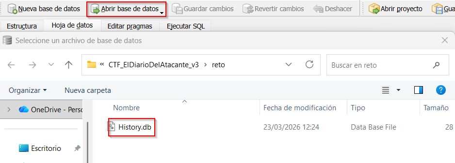
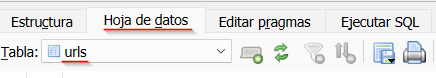
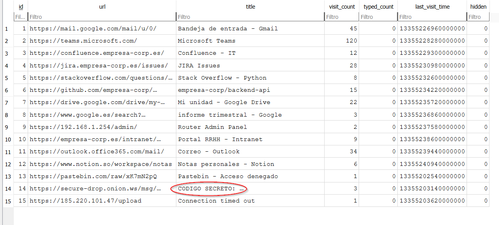
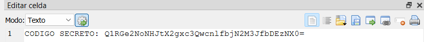
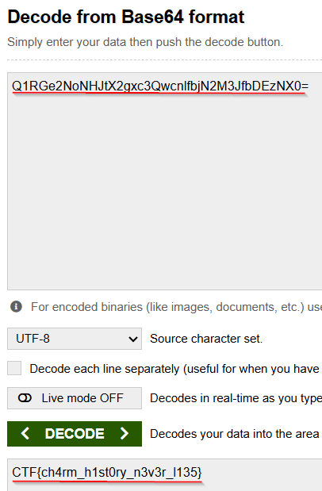

# Writeup — Diario del Atacante

**Categoría:** Forense | **Dificultad:** Media | **Puntos:** 50
**Flag:** `CTF{ch4rm_h1st0ry_n3v3r_l135}`

---

## Fase 1 — Identificar el archivo

El archivo `History` tiene la extensión `.txt`. Al abrirlo con un editor muestra `SQLite format 3` al inicio.

**Solución:** Renombrar a `History.db` y abrir con **DB Browser for SQLite**.


> Si no se dispone de la herramienta DB Browser for SQLite descargar desde la siguiente url: https://sqlitebrowser.org/dl/

---

## Fase 2 — Explorar la tabla `urls`

Abrimos la herramienta de DB Browser for SQLite y clickamos en opendatabase y seleccionamos el archivo `History.db`



A continuacion, con la base de datos cargada, hacemos click en pestaña **"Hoja de datos"** → tabla **`urls`**.



Mirando los registros se observa actividad totalmente normal pero la fila 14 llama la atención inmediatamente: el título de la página dice literalmente **"CODIGO SECRETO:"** seguido de una cadena en Base64.




---

## Fase 3 — Decodificar la flag

La cadena `Q1RGe2NoNHJtX2gxc3QwcnlfbjN2M3JfbDEzNX0=` tiene el padding `=` característico de Base64.

Desde la pag web https://www.base64decode.org/ pegamos la cadena y nos da el resultado inmediatamente:



**Resultado:**
```
CTF{ch4rm_h1st0ry_n3v3r_l135}
```
