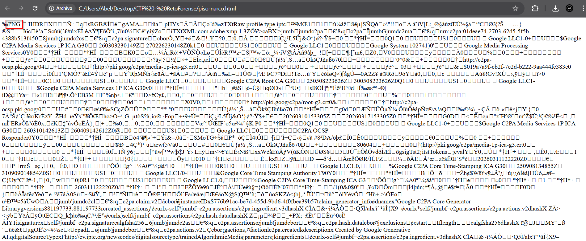
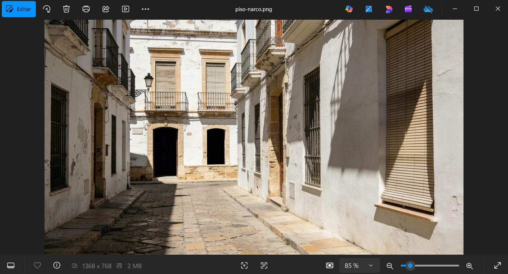
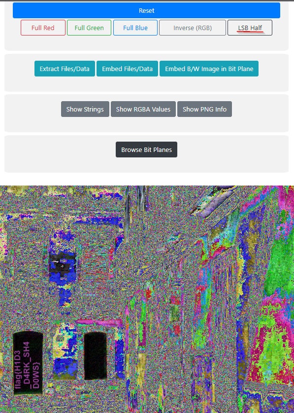

# Write-Up: Operación contra el narcotráfico

**Categoría:** Forense  
**Puntos:** 10  
**Archivo:** `piso-narco.html`

---

## Descripción del reto

Durante el registro del dispositivo móvil de un delincuente, los investigadores localizaron un archivo sospechoso llamado `piso-narco.html`. A simple vista parece un archivo HTML sin utilidad, pero, por el contexto del caso, se cree que en realidad contiene información relevante para la investigación. Tu tarea como analista forense es examinar el archivo entregado, determinar su verdadera naturaleza y recuperar la evidencia oculta. Se sospecha que el archivo ha sido modificado o renombrado para dificultar su identificación.

---

## Resolución

### Paso 1 – Análisis inicial del archivo

Tras descargar el archivo `piso-narco.html`, lo abrimos con un editor de texto o visor de código para inspeccionar su contenido.
En la cabecera del archivo, se puede observar la cadena de texto **`PNG`**, por lo que podemos intuir que se trata de una imagen.



Esto es una señal clara de que el archivo **no es realmente un HTML**, sino que ha sido renombrado para ocultar su verdadera naturaleza.

> **Nota:** Para confirmarlo de forma inequívoca, se puede utilizar la herramienta `exiftool`:
>
> ```bash
> exiftool piso-narco.html
> ```
>
> La salida mostrará que el tipo de archivo real es `PNG Image`, lo que valida la hipótesis.

---

### Paso 2 – Cambio de extensión

Una vez confirmado que el archivo es una imagen PNG, procedemos a cambiar su extensión.



Al abrir la imagen resultante, vemos una imagen aparentemente sin contenido relevante: no hay texto visible ni ningún elemento que llame la atención a simple vista.

Esto nos indica que la información oculta no está a plena vista, sino que ha sido **embebida mediante técnicas de esteganografía**.

---

### Paso 3 – Análisis esteganográfico con StegOnline

Para extraer la información oculta utilizamos la herramienta online **[StegOnline](https://georgeom.net/StegOnline/upload)**, que permite analizar imágenes en busca de datos ocultos en los bits menos significativos (LSB – *Least Significant Bit*).

**Procedimiento:**

1. Acceder a [StegOnline](https://georgeom.net/StegOnline/upload).
2. Arrastrar o cargar el archivo `piso-narco.png`.
3. Explorar las distintas opciones de visualización disponibles.
4. Seleccionar la opción **"LSB Half"**.



Al activar esta opción, la flag del reto aparece claramente visible en la imagen procesada.

---

## Herramientas utilizadas

| Herramienta | Uso |
|-------------|-----|
| Editor de texto  | Inspección del encabezado del archivo |
| `exiftool` | Verificación del tipo real del archivo |
| **StegOnline** | Análisis esteganográfico LSB |

---

## Flag

```
flag{H1D3_D4RK_SH4D0WS}
```
